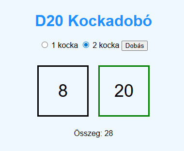

D20 Kockadobó Alkalmazás

Az alkalmazás egy véletlenszerű D20 kockadobást végez el, és ennek eredményét webes felületen jeleníti meg.
A felhasználói felület elérhető a http://localhost:8080 url-en azon a gépen, ami az alkalmazást futtatja.

Build:
1. Telepítsük az operációs rendszerünknek megfelelő Go-t: https://go.dev/doc/install
2. A rendszerünk parancssoros felületével navigáljunk a forráskód könyvtárába.
3. Adjuk ki a következő build parancsok valamelyikét: 
   1. Linux rendszereken: `go build -o d20app`
   2. Windowson: `go build -o d20app.exe`
4. Ellenőrizzük, hogy létrejött-e a bináris futtatható állomány.

Docker:
1. A repo tartalmaz egy Dockerfile-t ami az alkalmazás konténerbe helyezésének leírója.
2. A Dockerfile alapján lehet docker image-et készíteni az appból, amely így minden függőségével együtt könnyen hordozhatóvá válik.
   1. Docker image készítése, a Dockerfile könyvtárában állva: `docker build -t d20-roller:v1 .`
3. Az elkészült Docker image-ből futtatható a konténer: `docker run -p 8080:8080 d20-roller:v1`

CD - Futtatás felhő szolgáltatással:
1. Szolgáltató: Render (free tier)  
2. Deploy lépések:
   1. Regisztráció Render.com-on, GitHub repo csatlakoztatása.
   2. Új Web Service létrehozása
   3. Build parancs: `go build -o d20app`
   4. Start parancs: `./d20app`

Megj.: Az applikáció go.mod leírójában frissebb Go verzió volt megkövetelve, mint amit a Render tud, ezért csökkentenem kellett.

Publikus URL: https://d20-roller.onrender.com
A szolgáltató a free tier miatt igyekszik leállítani a szolgáltatást.
Időnként 1 perc is eltelik az első hívástól számítva, mire elérhetővé válik ismét.